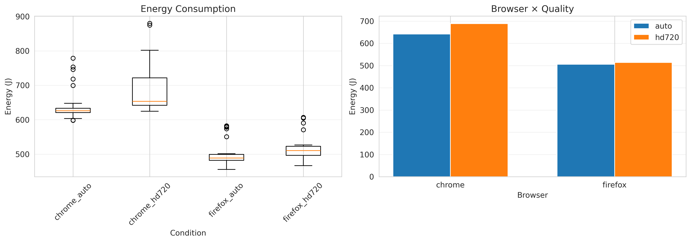
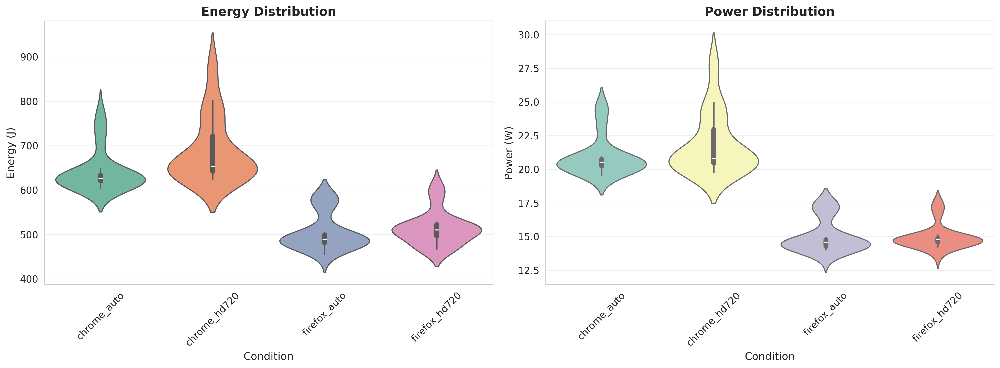
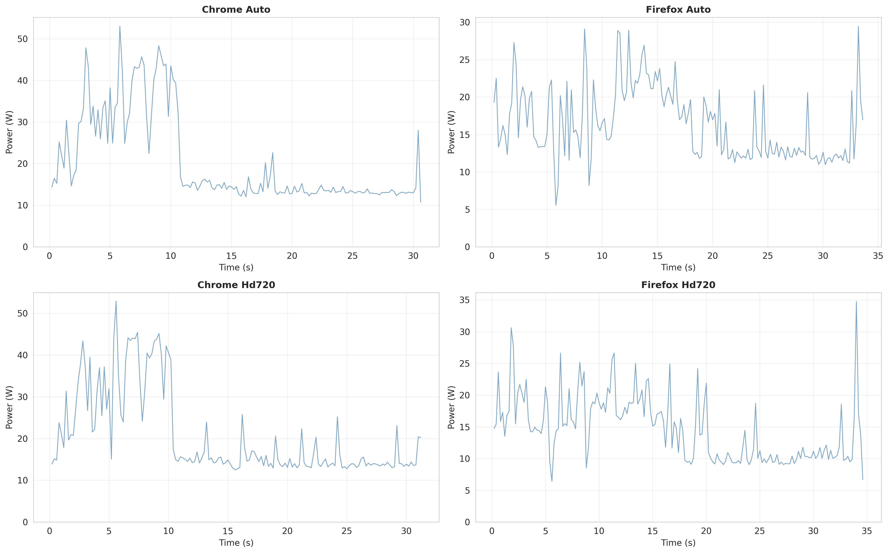
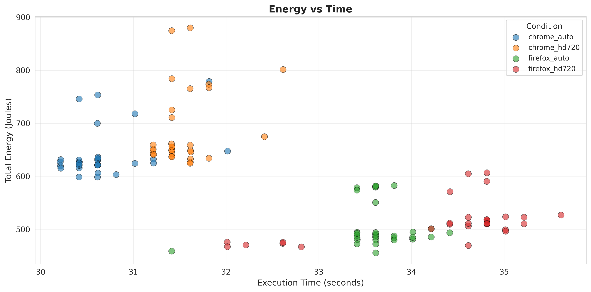

## Introduction
Video streaming has completely changed how we spend our time online. However, when it comes to streaming, YouTube is still the number one most used website[^1]. According to YouTube's CEO[^2], people have watched over 1 billion hours of YouTube on their TVs every day. Because of this, the platform's energy use really adds up.

In this study, we measured the energy and power consumption of streaming YouTube videos under four conditions:
1. **Google Chrome** on Auto Quality
2. **Google Chrome** on 720p HD Quality
3. **Mozilla Firefox** on Auto Quality
4. **Mozilla Firefox** on 720p HD Quality

The goal of this report is to determine how video quality and browser choice affect energy consumption.

## Background

According to Cloudflare[^3], streaming is the continuous transmission of audio or video files from a server to a client device. Unlike downloading, where you have to save the whole file to your hard drive before you can open it, streaming lets you start watching almost immediately.

The process works by breaking the video data into small packets. These packets are sent over the internet and later organized by your browser so the video plays continuously and smoothly. Most streaming services use a buffer to load the next few seconds of the video before they are even played. This helps prevent the video from freezing if your internet speed drops for a moment. To make this faster, companies often use Content Delivery Networks (CDNs) to store the video on servers physically closer to the user, reducing the distance the data has to travel.

YouTube takes streaming a step further with its auto-quality setting. The auto-quality setting allows for adaptive bitrate streaming. With this setting, your browser uses data to pick which set of bits to send. If your internet speed is high, it will send higher-quality packets. In comparison, if it dips or is generally slower, it will pick lower-quality packets, so the video does not buffer[^4].

The choice of browser is also very important; Chrome and Firefox might look similar on the outside, but they use completely different engines. A browser engine consists of 2 main engines. The rendering engine, which visualizes the data for you, and the JavaScript engine, which compiles and executes the code[^5]. Chrome uses the Blink rendering engine created by themself together with the V8 JavaScript engine, while Firefox uses Gecko and SpiderMonkey for these operations[^5].

## Methodology

To ensure accurate and reproducible results, we automated our testing pipeline using a custom Bash script. All experiments were conducted on a Linux machine with an AMD Ryzen 7 4000-series processor. 

We used **Energibridge** to measure the raw energy and power consumption during the video playback, exporting the telemetry data into CSV files for analysis. Our automated pipeline read from a pre-generated execution plan and used a Python script (`play_video.py`) to launch the specified browser, navigate to the YouTube URL, and set the target video quality.

**CONTINUE METHODOLOGY** Talk about ZEN and how we changed settings so the screen doesn't change, etc.

## Results

The most important thing we found is that browser choice matters much more than video quality. Even when lowering the resolution, using the wrong browser can still waste significant energy.

### Energy Comparison
The tests showed that Firefox is much more efficient than Chrome. 

As seen in the chart above, here is the average energy used for each:

* **Firefox:** about **505 Joules** (Auto) and **513.6 Joules** (720p).
* **Chrome:** about **642.1 Joules** (Auto) and **688.5 Joules** (720p).

While switching to 720p HD did use more power in both browsers, the difference was small. The real "energy penalty" comes from using Chrome instead of Firefox.

---

### Steady Power vs. Spikes
We also looked at how steady the power usage was for each browser. 

The plots show that Chrome's power usage fluctuates widely, ranging from **20W to 26W**. Firefox is much more stable and stays mostly around **14W to 15W**.

By looking at power usage over time, we found out why Chrome uses more power. 

Right when a video starts, Chrome has huge power spikes. It jumps up to **45 or 50 Watts** in the first 10 seconds. Firefox is much smoother and rarely goes above **30 Watts**. It seems like Chrome tries to load everything as fast as possible, but that uses a lot of extra electricity.

---

### Is Speed Worth the Extra Energy?
There is a small trade-off for Firefox being greener. Because Chrome uses so much power, it finishes loading the video tasks faster.

Chrome finished the tests in roughly **31 to 32 seconds**, while Firefox took about **34 to 35 seconds**. Even though Firefox takes a few seconds longer, it draws less power. Firefox uses about **11 Joules per second**, while Chrome uses **16 to 17 Joules per second**. In the end, Firefox is the clear winner for saving your battery and the environment.

### Sources
[^1]: [Cloudflare Radar 2025 Year in Review](https://radar.cloudflare.com/year-in-review/2025)
[^2]: [YouTube CEO 2025 Priorities: Our Big Bets](https://blog.youtube/inside-youtube/our-big-bets-for-2025/)
[^3]: [What is streaming?](https://www.cloudflare.com/learning/video/what-is-streaming/)
[^4]: [What is adaptive bitrate streaming?](https://www.cloudflare.com/learning/video/what-is-adaptive-bitrate-streaming/)
[^5]: [Browser Engines: The Crux of Cross Browser Compatibility](https://www.testmuai.com/blog/browser-engines-the-crux-of-cross-browser-compatibility/)
