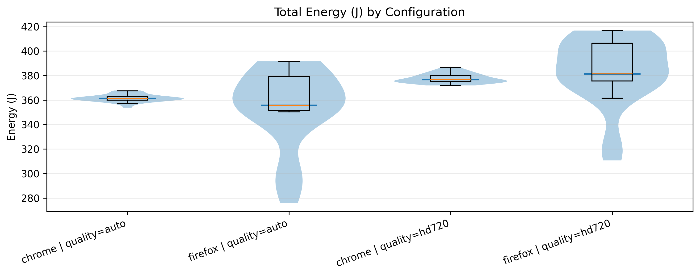
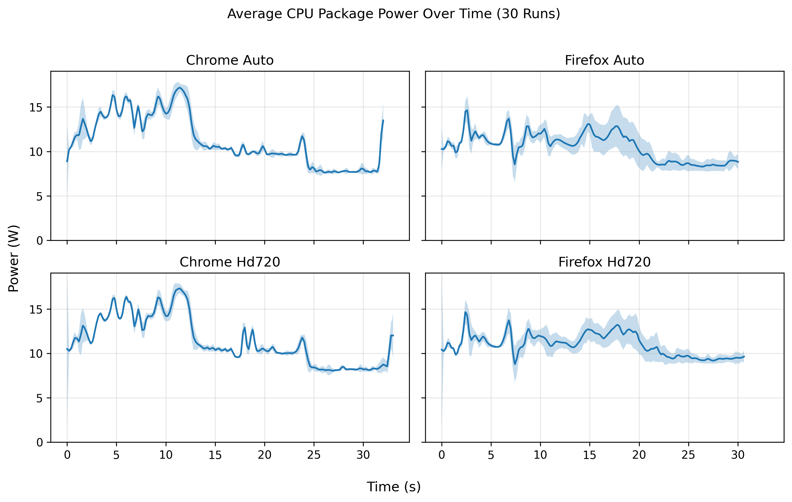
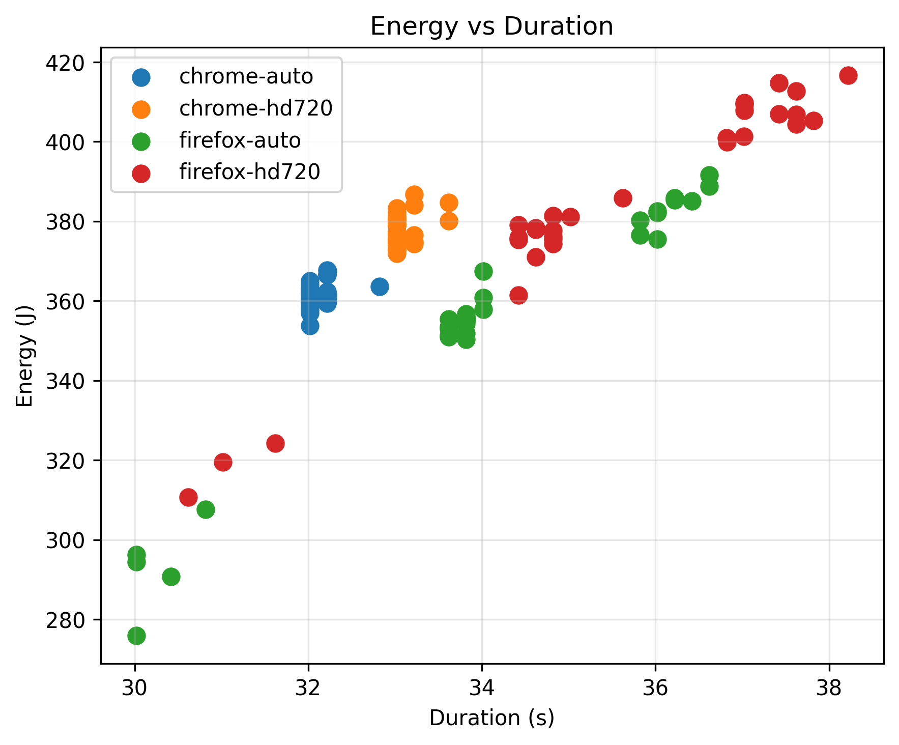
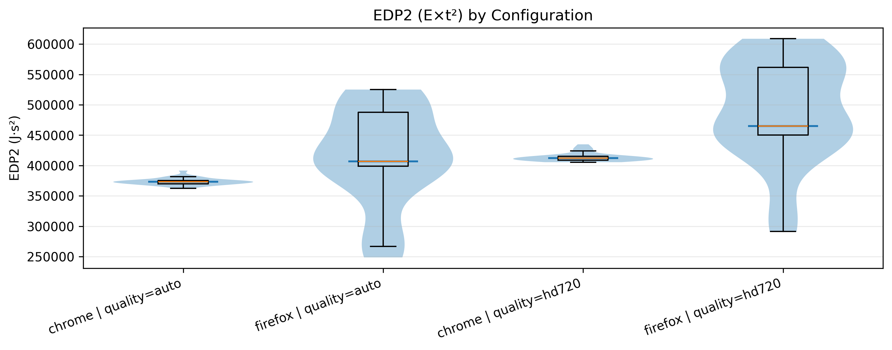

## Introduction

Nowadays, video streaming has become one of the most frequently used services on the internet, accounting for a significant portion of the internet traffic and mobile device usage. According to YouTube's CEO, YouTube is still the most widely used streaming platform with users watching a total of over 1 billion hours of content every day [^2]. While this huge usage rate highlights the platform's importance in the modern internet world, people pay little attention to the amount of energy being used by video streaming.

The amount of energy that is being consumed by software systems is not only influenced by hardware selection, but also by software design choices and personal user settings. When speaking of video streaming on the web, power usage is being affected by factors such as browser engine implementations, hardware acceleration, and video quality selection. Users are predominantly unaware of these differences and select their browser and settings based on convenience, rather than power usage.

This study attempts to give better insight into how browser selection and video quality settings affect energy consumption in YouTube video streaming. For this purpose, we investigate two of the most widely used browsers - **Google Chrome** and **Mozilla Firefox** - under two video quality settings - **Auto** quality and fixed **720p HD** - while using the same YouTube video for each configuration. By conducting an automated experiment and making precise energy consumption measurements, we aim to answer the following research question: 

- *How do video quality and browser choice affect energy consumption in video streaming?*

The remainder of this report is structured as follows. We begin by giving some background to the challenges of video streaming implementations and how some streaming platforms approach them. Then, we present the methodology used for our experiments, followed by the results and analysis. Finally, the report ends with a conclusion.

## Background

According to Cloudflare[^3], streaming is the continuous transmission of audio or video files from a server to a client device. Unlike downloading, where you have to save the whole file to your hard drive before you can open it, streaming lets you start watching almost immediately.

The process works by breaking the video data into small packets. These packets are sent over the internet and later organized by your browser so the video plays continuously and smoothly. Most streaming services use a buffer to load the next few seconds of the video before they are even played. This helps prevent the video from freezing if your internet speed drops for a moment. To make this faster, companies often use Content Delivery Networks (CDNs) to store the video on servers physically closer to the user, reducing the distance the data has to travel.

YouTube takes streaming a step further with its auto-quality setting. The auto-quality setting allows for adaptive bitrate streaming. With this setting, your browser uses data to pick which set of bits to send. If your internet speed is high, it will send higher-quality packets. In comparison, if it dips or is generally slower, it will pick lower-quality packets, so the video does not buffer[^4].

The choice of browser is also very important; Chrome and Firefox might look similar on the outside, but they use completely different engines. A browser engine consists of 2 main engines. The rendering engine, which visualizes the data for you, and the JavaScript engine, which compiles and executes the code[^5]. Chrome uses the Blink rendering engine created by themself together with the V8 JavaScript engine, while Firefox uses Gecko and SpiderMonkey for these operations[^5].


## Methodology

To ensure accurate and reproducible results, we automated our testing pipeline using a custom Bash script. All experiments were conducted on a Linux machine with an **[PLEASE ADD PROCESSOR AND PC INFORMATION HERE]**. 

We used **Energibridge** to measure the raw energy and power consumption during the video playback, exporting the telemetry data into CSV files for analysis. Our automated pipeline read from a pre-generated execution plan and used a Python script (`play_video.py`) to launch the specified browser, navigate to the YouTube URL, and set the target video quality.

**CONTINUE METHODOLOGY** Talk about ZEN and how we changed settings so the screen doesn't change, etc.

## Results

The most important thing we found is that browser choice matters much more than video quality. Even when lowering the resolution, using the wrong browser can still waste significant energy.

### Energy Comparison
The tests showed that Firefox is much more efficient than Chrome. 



As shown in the chart above, Chrome's energy use is very tightly packed. 
* **Chrome** consistently uses about **360 Joules** on Auto and **375 Joules** on 720p. 
* **Firefox** is highly unpredictable. Its energy use swings wildly from as low as **280 Joules** to over **415 Joules**.

While switching to 720p HD, both browsers used more power, but the difference was small. While Firefox was highly unpredictable.

---

### Steady Power vs. Spikes

By looking at power usage over time, we found out why Firefox uses more power. 



Right when a video starts, Chrome has huge power spikes. It jumps above *15 Watts** in the first 10 seconds. Firefox is much smoother and rarely goes above **15 Watts**. However Firefox remains around this power level while chrome loads everything with a burst and than reduces to lower levels of power consumption afterwards.

---

### Consistency and speed
We compared how much energy was used versus how long the video task took to finish.



This scatter plot shows exactly why Chrome is better. The blue and orange dots for Chrome are tightly grouped together. Chrome finishes the video loading task in a very consistent **32 to 33 seconds**. 
The green and red dots for Firefox are scattered all over the place. Firefox can take anywhere from **30 seconds to 38 seconds** to finish the same exact task
### Overall Efficiency (EDP)
To get a final score for each browser, we used a metric called the Energy-Delay Product (EDP). This formula multiplies the energy used by the time taken to see which browser has the best balance of speed and battery life.



Just like the other tests, Chrome proves to be incredibly reliable. Its EDP score stays tightly clustered around **375,000** for Auto quality and **410,000** for HD. Firefox is completely unstable, with its HD score swinging all the way up past **600,000**. Because Chrome avoids these massive penalties and stays predictable, it is the clear winner for a smooth and battery-friendly streaming experience.

### 4.5 Statistical Significance
To make sure our findings were true and not just random luck, we used the `scipy.stats` library in Python to test the math. First, we ran a Shapiro-Wilk test to see if the energy data was normally distributed like a bell curve:

```python
from scipy.stats import shapiro, mannwhitneyu

# Check for normal distribution
for (browser, quality), grp in data.groupby(['browser', 'quality']):
    p_value = shapiro(grp['energy_j']).pvalue
    print(f"{browser} {quality} Shapiro p={p_value:.3f}")
```

The output revealed that Chrome's data was normal, but Firefox's data was not (`p = 0.000` and `p = 0.001`). Because Firefox's scores were too erratic to be normal, we used the non-parametric Mann-Whitney U test to safely compare the two browsers.

```python
# Mann-Whitney U Test: Chrome vs Firefox on HD720
chrome_hd = data[(data.quality == "hd720") & (data.browser == "chrome")]['energy_j']
firefox_hd = data[(data.quality == "hd720") & (data.browser == "firefox")]['energy_j']

stat, p = mannwhitneyu(chrome_hd, firefox_hd, alternative="two-sided")
print(f"HD720 Mann-Whitney p={p:.4g}")
```

The tests proved three main points:
1. **Quality Matters:** When comparing all Auto runs to all 720p runs, the test gave a microscopic p-value (`p = 4.4 x 10^-11`). This proves that forcing the video to HD definitively changes the energy used.
2. **Browsers Differ on HD:** When watching in 720p, the difference between Chrome and Firefox is statistically significant (`p = 0.03147`). 
3. **Auto is Too Unpredictable:** On Auto quality, the difference was not statistically significant (`p = 0.137`). Firefox's results were so wild and scattered that the math could not prove a clear difference between the two browsers on this specific setting.

### Sources
[^1]: [Cloudflare Radar 2025 Year in Review](https://radar.cloudflare.com/year-in-review/2025)
[^2]: [YouTube CEO 2025 Priorities: Our Big Bets](https://blog.youtube/inside-youtube/our-big-bets-for-2025/)
[^3]: [What is streaming?](https://www.cloudflare.com/learning/video/what-is-streaming/)
[^4]: [What is adaptive bitrate streaming?](https://www.cloudflare.com/learning/video/what-is-adaptive-bitrate-streaming/)
[^5]: [Browser Engines: The Crux of Cross Browser Compatibility](https://www.testmuai.com/blog/browser-engines-the-crux-of-cross-browser-compatibility/)